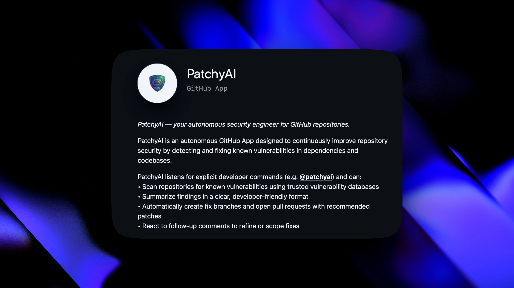

# PatchyAI 🤖🔒

> An autonomous GitHub App that continuously improves repository security by detecting and fixing known vulnerabilities in dependencies and codebases.


<!-- Add showcase image here -->

## 📹 Demo on YouTube

[](https://youtu.be/std1Ihd9eC8)

## 🎯 Overview

PatchyAI was born out of a real security incident. After receiving an email from Vercel about the recently discovered **react2shell** vulnerability (CVSS 10.0) affecting one of my projects, I realized the need for automated security patching. Instead of manually reviewing and fixing vulnerabilities across multiple repositories, I built Patchy to automate the entire process.

## ✨ Features

- **🔍 Automated Vulnerability Scanning**: Continuously scans repositories for known vulnerabilities using trusted security databases (OSV Scanner)
- **📊 Clear Summaries**: Provides developer-friendly reports of security findings
- **🔧 Automatic Fixes**: Creates fix branches and opens pull requests with recommended patches
- **💬 Interactive Refinement**: Responds to follow-up comments to refine or adjust fixes
- **🔄 Seamless Integration**: Works natively with GitHub workflows and developer tools

Built for modern **DevSecOps** workflows, PatchyAI integrates seamlessly into GitHub repositories to reduce security debt while keeping developers in complete control.

## 🛠️ Tech Stack

- **[Kestra](https://kestra.io/)**: Workflow orchestration and automation
- **[Cline CLI](https://github.com/cline/cline)**: AI-powered vulnerability fixing
- **[Vercel](https://vercel.com/)**: Web application hosting
- **[OSV Scanner](https://google.github.io/osv-scanner/)**: Vulnerability detection
- **GitHub API**: Repository management and PR automation

## 🚀 Quick Start

### Installing the GitHub App

1. Visit the [PatchyAI GitHub App](https://github.com/apps/patchyai) <!-- Update with actual link -->
2. Click "Install" and select the repositories you want to protect
3. Add GEMINI API Key on the redirected setup page.

### Manual Scanning

You can trigger a manual scan by creating an issue or commenting on a PR with:
```
@patchyai scan
```

## 🏗️ Architecture

PatchyAI uses a serverless workflow architecture:

1. **GitHub Webhooks** → Triggers on push, PR, or scheduled scans
2. **Kestra Workflows** → Orchestrates scanning and fixing processes
3. **Cline CLI** → AI agent performs intelligent code fixes
4. **GitHub API** → Creates branches, commits, and pull requests

## 🔐 Security & Privacy

- All scans run in isolated Docker containers
- No code is stored permanently; only vulnerability reports are retained
- API keys are securely managed through Kestra's secret management
- All fixes are reviewed via pull requests before merging

## 🤝 Contributing

Contributions are welcome! Please feel free to submit a Pull Request.

1. Fork the repository
2. Create your feature branch (`git checkout -b feature/AmazingFeature`)
3. Commit your changes (`git commit -m 'Add some AmazingFeature'`)
4. Push to the branch (`git push origin feature/AmazingFeature`)
5. Open a Pull Request

## 📝 License

This project is licensed under the MIT License - see the LICENSE file for details.

## 🙏 Acknowledgments

- [Google OSV Scanner](https://google.github.io/osv-scanner/) for vulnerability detection
- [Kestra](https://kestra.io/) for workflow orchestration
- [Cline](https://github.com/cline/cline) for AI-powered code assistance

## 📧 Contact

For questions, issues, or feature requests, please open an issue on GitHub or contact [@xkaper001](https://github.com/xkaper001).

---

Made with ❤️ to keep your code secure
